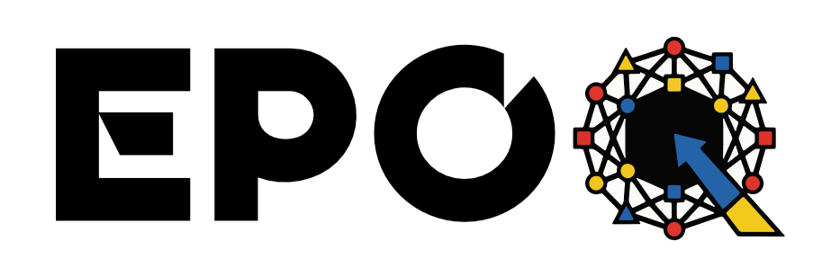

<div align="center">



**A powerful, cross-platform desktop application for training image classification models.**

[](https://tauri.app)
[](https://nextjs.org)
[](https://pytorch.org)
[](https://www.rust-lang.org)
[](https://opensource.org/licenses/MIT)

[Features](#-features) • [Prerequisites](#-prerequisites) • [Installation](#-installation) • [Usage](#-usage) • [Architecture](#-architecture) • [Contributing](#-contributing)

</div>

---

## 📖 Overview

**EPOQ** brings the power of deep learning to your desktop. Built with **Tauri**, **Next.js**, and **PyTorch**, this application provides a sleek, intuitive GUI for training state-of-the-art image classification models locally. Say goodbye to complex CLI scripts and hello to real-time visual feedback!

## ✨ Features

- 🗂️ **Smart Dataset Management**: Easily select folders with `train`/`val` structures, or let the app auto-split flat folders. Export your prepared dataset to a ZIP file with one click.
- ⚙️ **Flexible Model Configuration**: Choose from modern architectures including **ResNet18**, **DCN**, and **EVA02**. Customize training epochs and batch sizes to suit your hardware.
- 📈 **Real-Time Analytics**: Monitor the training process with live PyTorch logs and dynamic, interactive **Loss and Accuracy Charts** (powered by Recharts).
- 📊 **Comprehensive Results**: After training completes, dive into detailed metrics with a full **Classification Report** and a visual **Confusion Matrix**.
- 🚀 **Native Performance**: Engineered with Rust and Tauri for a lightweight desktop footprint, paired with a blazing-fast Next.js frontend.

## 🛠️ Tech Stack

| Layer | Technologies |
|---|---|
| **Frontend** | Next.js, React, Tailwind CSS, Framer Motion, Lucide Icons, Recharts |
| **Desktop Platform** | Tauri v2, Rust |
| **Machine Learning** | Python, PyTorch, Torchvision, Scikit-learn, Pandas, Matplotlib, Seaborn |

---

## 🏗️ Architecture

EPOQ has **three distinct layers** that communicate with each other:

```
┌──────────────────────────────────────────────────────────┐
│                    DESKTOP APP WINDOW                    │
│          (Powered by Tauri — like Electron but tiny)     │
│                                                          │
│  ┌──────────────────────────────────────────────────┐   │
│  │            Next.js Frontend  (UI Layer)          │   │
│  │   React components + Tailwind + Recharts charts  │   │
│  │   Framer Motion animations + Lucide Icons        │   │
│  └──────────────────┬─────────────────────────────-─┘   │
│                     │  Tauri Commands (IPC bridge)       │
│  ┌──────────────────▼───────────────────────────────┐   │
│  │            Rust Core  (Tauri Backend)             │   │
│  │   Manages filesystem, dialogs, OS integrations   │   │
│  │   Spawns Python subprocess, streams logs to UI   │   │
│  └──────────────────┬─────────────────────────────-─┘   │
│                     │  subprocess / stdout stream        │
│  ┌──────────────────▼───────────────────────────────┐   │
│  │         Python + PyTorch  (ML Worker)             │   │
│  │   script.py        — training loop               │   │
│  │   model_factory.py — loads ResNet, EVA02, DCN    │   │
│  │   scikit-learn     — metrics, confusion matrix   │   │
│  └──────────────────────────────────────────────────┘   │
└──────────────────────────────────────────────────────────┘
```

### How it flows

1. **You click "Start Training"** in the Next.js UI.
2. **Tauri (Rust)** receives that event, opens file dialogs, and spawns a Python subprocess.
3. **Python** runs the real PyTorch training loop and prints logs/metrics to stdout.
4. **Rust** streams that stdout back to the frontend in real time.
5. **The UI** displays live loss/accuracy charts and logs as training progresses.

### Why this architecture?

| Decision | Reasoning |
|---|---|
| **Tauri over Electron** | Tauri uses the OS's native WebView + Rust backend, making the binary ~10x smaller than Electron with better performance. |
| **Rust as the bridge** | Safe, fast, and excellent for system operations — launching subprocesses, reading the filesystem, opening native dialogs. |
| **Python for ML** | The entire ML ecosystem (PyTorch, scikit-learn, etc.) is Python-first. There is no comparable alternative. |
| **Next.js for UI** | The UI is just a web page, so frontend developers can contribute without learning any desktop-specific framework. |

---

## 📁 Project Structure

```
EPOQ/
└── image-trainer/              # The full desktop application
    ├── src/app/                # Next.js pages (UI screens)
    ├── src-tauri/              # Rust + Tauri backend
    │   ├── src/                # Rust source (main.rs)
    │   ├── python_backend/     # Python ML scripts
    │   │   ├── script.py           # Main training loop
    │   │   ├── model_factory.py    # Model architecture loader
    │   │   ├── tabular_processor.py
    │   │   └── check_gpu.py
    │   └── tauri.conf.json     # Tauri app configuration
    └── public/                 # Static assets
```

---

## 🚀 Prerequisites

### System Requirements

Before you begin, ensure you have the following installed:

1. **[Node.js](https://nodejs.org/)** (v18+)
2. **[Rust](https://rustup.rs/)** (Required for Tauri builds)
3. **[Python](https://www.python.org/downloads/)** (3.9+)
4. **Machine Learning Dependencies**:
   ```bash
   pip install torch torchvision pandas scikit-learn matplotlib seaborn
   ```

### Knowledge Prerequisites

You don't need to know all of this before you start — but here's what's useful to learn for each layer of the project:

| Layer | Concept to know | Why it matters |
|---|---|---|
| **UI (Frontend)** | HTML & CSS basics | Foundation for any web work |
| **UI (Frontend)** | JavaScript / TypeScript | Language of the frontend |
| **UI (Frontend)** | React (components, hooks, state) | All UI components are built in React |
| **UI (Frontend)** | Next.js App Router | How pages and routing are structured |
| **UI (Frontend)** | TailwindCSS | How styling is done in this project |
| **Desktop Bridge** | What Tauri/IPC is (conceptual) | How the UI talks to Rust |
| **Desktop Bridge** | Rust basics *(optional)* | Only needed for Tauri backend changes |
| **ML Worker** | Python basics | The ML scripts are all Python |
| **ML Worker** | PyTorch basics | Training loops, models, tensors |
| **ML Worker** | Basic ML concepts (epochs, loss, accuracy) | Understanding what the app is doing |

> 💡 **Tip:** If you're new to the project, start with the **UI layer** — it's the most approachable and doesn't require knowing Rust or Python.

---

## 📚 Suggested Learning Order

If you're starting from scratch, here's the most efficient path to being able to contribute:

```
Step 1 — Web Fundamentals (1–2 weeks)
   HTML + CSS basics
   → Resource: MDN Web Docs (developer.mozilla.org)

Step 2 — JavaScript ES6+ (2–4 weeks)
   Arrow functions, async/await, modules, array methods
   → Resource: javascript.info

Step 3 — TypeScript Basics (1 week)
   Types, interfaces, generics
   → Resource: TypeScript Handbook (typescriptlang.org/docs)

Step 4 — React (2–3 weeks)
   Components, props, state, hooks (useState, useEffect)
   → Resource: react.dev (official docs)

Step 5 — Next.js (1 week)
   App Router, file-based routing, layouts
   → Resource: nextjs.org/docs

Step 6 — TailwindCSS (2–3 days)
   Utility classes, responsive design
   → Resource: tailwindcss.com/docs

        ✅ You can now contribute to the UI layer!

Step 7 — Python Basics (2–3 weeks, if not already known)
   Functions, classes, file I/O
   → Resource: python.org/about/gettingstarted

Step 8 — PyTorch Basics (3–4 weeks)
   Tensors, datasets, training loops, model loading
   → Resource: pytorch.org/tutorials

Step 9 — ML Fundamentals (ongoing)
   Loss functions, evaluation metrics, confusion matrices
   → Resource: fast.ai (free, practical course)

        ✅ You can now contribute to the ML worker layer!

Step 10 — Rust Basics (optional, 2–4 weeks)
   Ownership, structs, enums, subprocess management
   → Resource: doc.rust-lang.org/book (The Rust Book)

        ✅ You can now contribute to the Tauri backend layer!
```

---

## 💻 Installation

1. **Clone the repository**

   ```bash
   git clone https://github.com/Sree14hari/EPOQ.git
   cd EPOQ
   ```

2. **Install Node dependencies**

   ```bash
   cd image-trainer
   npm install
   ```

3. **Start Development Server**
   ```bash
   npm run tauri dev
   ```
   _This command will compile the Rust backend, start the Next.js frontend, and launch the desktop window._

---

## 📦 Building for Production

To create an optimized, standalone executable for your operating system:

```bash
npm run tauri build
```

Once the build is complete, you can find the executable in `src-tauri/target/release/`.

---

## 🤝 Contributing

Contributions are what make the open-source community such an amazing place to learn, inspire, and create. Any contributions you make are **greatly appreciated**.

1. Fork the Project
2. Create your Feature Branch (`git checkout -b feature/AmazingFeature`)
3. Commit your Changes (`git commit -m 'Add some AmazingFeature'`)
4. Push to the Branch (`git push origin feature/AmazingFeature`)
5. Open a Pull Request

---

## 📄 License

Distributed under the MIT License. See `LICENSE` for more information.

---

<div align="center">
  Made with ❤️ by the Sreehari R
</div>
